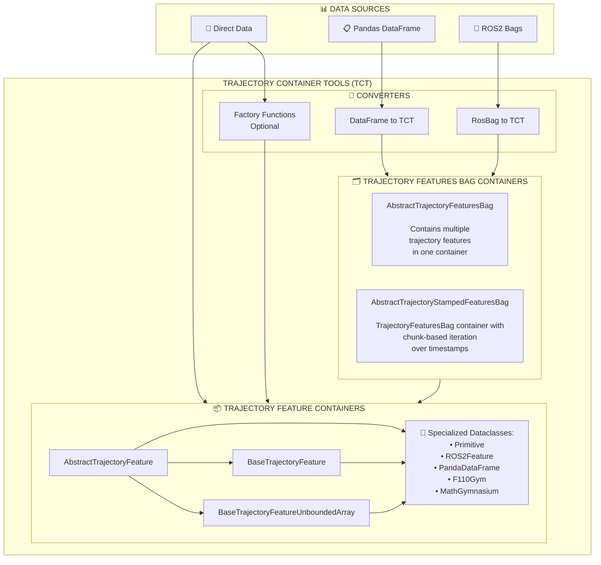

# Trajectory Container Tools Documentation

Welcome to the comprehensive documentation for **Trajectory Container Tools (TCT)** - a Python library for managing trajectory-related data across multiple sources and formats.

## 📚 Table of Contents

<!-- TOC -->
* [Trajectory Container Tools Documentation](#trajectory-container-tools-documentation)
  * [📚 Table of Contents](#-table-of-contents)
  * [Overview](#overview)
    * [Core Flow Explanation](#core-flow-explanation)
  * [Interactive Jupyter notebook examples:](#interactive-jupyter-notebook-examples)
  * [Usage Guides](#usage-guides)
    * [🔧 TCT Direct Instantiation Guide](#-tct-direct-instantiation-guide)
    * [📊 DataFrame To TCT Usage Guide](#-dataframe-to-tct-usage-guide)
    * [🤖 ROS Bag To TCT  Usage Guide](#-ros-bag-to-tct--usage-guide-)
    * [🔄 Post-Processing Callbacks Guide](#-post-processing-callbacks-guide)
    * [🧩 Typing and Internal Fields Guide](#-typing-and-internal-fields-guide)
  * [Core Concepts](#core-concepts)
    * [Trajectory Containers](#trajectory-containers)
    * [Factory Pattern](#factory-pattern)
    * [Feature Specifications](#feature-specifications)
  * [Data Sources & Converters](#data-sources--converters)
    * [1. Pandas DataFrame Converter](#1-pandas-dataframe-converter)
    * [2. ROS Bag Converter](#2-ros-bag-converter)
    * [3. Direct Instantiation](#3-direct-instantiation)
  * [Need Help?](#need-help)
  * [Documentation](#documentation)
<!-- TOC -->

## Overview

TCT provides a unified interface for working with trajectory data from various sources:
- **Direct instantiation** → Custom trajectory containers
- **ROS bags** → Trajectory containers  
- **Pandas DataFrames** → Trajectory containers

The library is designed for robotics research, autonomous systems, and trajectory analysis workflows.



### Core Flow Explanation

1. **Data Sources**: TCT accepts data from three main sources:
   - **Pandas DataFrames**: Structured tabular data with trajectory information
   - **ROS2 Bags**: Robotics data from ROS2 bag files containing sensor/control messages
   - **Direct Data**: Raw numpy arrays or custom data for direct instantiation

2. **Converters**: Specialized functions transform raw data into trajectory containers:
   - **DataFrame to TCT**: Extracts features from DataFrame columns/rows
   - **RosBag to TCT**: Parses ROS2 messages and converts to trajectory format
   - **Factory Functions**: Dynamically creates custom trajectory dataclasses

3. **Trajectory Containers**: Type-safe dataclasses that provide:
   - **Structure**: Clear organization of trajectory dimensions (x, y, z, velocities, etc.)
   - **Validation**: Ensures data consistency and monotonic timestamps
   - **Access Patterns**: Indexing, slicing, iteration over timesteps
   - **Metadata**: Timestamps, dataset information, and trajectory properties


---

## Interactive [Jupyter notebook examples](../notebooks/):

- **[TCT Dataclass Usage Examples](../notebooks/direct_instanciation_usage_example.ipynb)** - Direct trajectory container instantiation
- **[DataFrame To TCT Usage Examples](../notebooks/dataframe_usage_example.ipynb)** - Convert pandas DataFrames to trajectory containers
- **[ROS Bag To TCT Usage Examples](../notebooks/rosbag_usage_example.ipynb)** - Extract trajectory data from ROS bags


## Usage Guides

### 🔧 [TCT Direct Instantiation Guide](direct_instantiation.md)
Guide for creating trajectory containers directly from data:
- Custom dataclass creation
- Data validation setup
- Advanced customization patterns
- Integration with existing workflows

### 📊 [DataFrame To TCT Usage Guide](dataframe_usage.md)
Complete guide for converting pandas DataFrames to trajectory containers:
- Basic conversion examples
- Custom post-processing
- Multi-feature aggregation
- Data validation and sanity checks

### 🤖 [ROS Bag To TCT  Usage Guide](rosbag_usage.md)  
Comprehensive guide for extracting trajectory data from ROS bags:
- Topic inspection and selection
- Message type handling
- Timestamp management

### 🔄 [Post-Processing Callbacks Guide](post_processing_callbacks.md)
Detailed guide for customizing trajectory data processing at instantiation:
- Three callback methods: `on_begin_post_init_callback`, `post_init_feature_callback`, `on_exit_post_init_callback`
- Dynamic field creation and manipulation
- Advanced examples and common patterns
- Integration with extractors (ROS bags, DataFrames)
- Best practices and use cases

### 🧩 [Typing and Internal Fields Guide](typing_and_internal_fields.md)
Understand how to mark fields as non-trajectory or internal:
- `tct.typing.NonTrajectoryField[...]` for metadata/static fields excluded from per‑timestep logic
- `tct.typing.ContainerInternalField[...]` for internal implementation details hidden from public API
- Effects on iteration, transpose `T`, ravel, and callbacks
- Dynamic attribute access helpers for derived fields

### ⏱️ [Timestamp Utilities Guide](timestamp_utilities.md)
Comprehensive guide for timestamp handling and utilities:
- Timestamps class methods: `min()`, `max()`, `is_timestamps_in_bounds()`
- Enhanced error handling with `TimestampMissingError` and `TimestampOutOfBoundError`
- TrajectoryFeaturesBag timestamp methods: `get_timestamps_interval()`, `trajectory_published_timestamps`, `trajectory_timestamps_metadata`
- Nearest timestamp search for data synchronization
- Practical examples for multi-sensor data handling


---


## Core Concepts

### Trajectory Containers

Trajectory containers are type-safe dataclasses that store trajectory data with:
- **Structured access** to trajectory dimensions (e.g., x, y, z, roll, pitch, yaw, etc.)
- **Metadata management** (timestamps, dataset information)
- **Data validation** (shape consistency, monotonic timestamps)

#### Multi-Feature Containers

TCT provides specialized containers for aggregating multiple trajectory features:

- **`AbstractTrajectoryFeaturesBag`**: Base container for multiple trajectory features
  - Aggregates different data sources (e.g., odometry, IMU, commands) into a single object
  - Provides unified access to all features through named attributes
  - Maintains metadata across all features

- **`AbstractTrajectoryStampedFeaturesBag`**: Extended trajectory features bag container with chunk-based iteration
  - Inherits all features from `AbstractTrajectoryFeaturesBag`
  - Enables iteration over synchronized timestamp chunks across all features
  - Useful for processing large datasets incrementally
  - Supports indexing and slicing by chunk

**Use Case Example**: When extracting data from a ROS bag with multiple topics (e.g., `/odom`, `/imu`, `/cmd`), the resulting container is an `AbstractTrajectoryStampedFeaturesBag` that allows you to iterate through synchronized time windows of all sensor data together.

### Factory Pattern

TCT uses a factory pattern to dynamically create trajectory containers based on configuration:

```python
import trajectory_container_tools as tct 

features_config = {
    'pose': tct.dataclasses.StatePose2D,
    'velocity': ('CustomVel', 'vx', 'vy', 'vtheta'),
    'commands': tct.dataclasses.CmdStandard
}
```

### Feature Specifications

Features are defined using either:
- **Predefined dataclasses**: `StatePose2D`, `StatePose3D`, `Velocity`, etc.
- **Tuple specifications**: `('ClassName', 'dim1', 'dim2', ...)`

## Data Sources & Converters

### 1. Pandas DataFrame Converter

Convert structured DataFrame data to trajectory containers:

**Key Functions:**
- `extractor.from_dataframe()` - Multiple features from DataFrame
- `extractor.extract_dataframe_feature()` - Single feature extraction
- `extractor.unpack_dataframe_and_show_topic()` - Inspect DataFrame structure

**Requirements:**
- DataFrame with timestep-indexed columns (e.g., `feature_1`, `feature_2`, ...)
- One trajectory per row or single trajectory with timestep columns

### 2. ROS Bag Converter

Extract trajectory data from ROS bag files:

**Key Functions:**
- `extractor.from_rosbag()` - Multiple ROS topics
- `extractor.extract_rosbag_feature()` - Single topic extraction
- `extractor.show_rosbag_summary_info()` - Inspect available topics

**Requirements:**
- ROS2


### 3. Direct Instantiation

Create trajectory containers directly from data arrays:

**Available Dataclasses:**
- `BaseTrajectoryFeature` - Basic trajectory container
- `BaseTrajectoryFeatureUnboundedArray` - Basic trajectory container with an array of many heterogenous length `BaseTrajectoryFeature`  
- Custom dataclasses inheriting from `AbstractTrajectoryFeature`

---

## Need Help?

- 💻 Run the [Jupyter notebook examples](../notebooks/) for hands-on learning in the `notebooks/` directory
- 🐛 Report issues on [GitHub Issues](https://github.com/norlab-ulaval/trajectory-container-tools/issues)

---

## Documentation

- [Landing page](../README.md#_trajectory-container-tools_)
- [Overview and Core concept](README.md#trajectory-container-tools-documentation)
    - ↳ [Direct Instantiation](./direct_instantiation.md#trajectory-container-tools---direct-instantiation-guide)
    - ↳ [Post-Processing Callbacks Guide](./post_processing_callbacks.md#post-processing-callbacks-in-tct)
    - ↳ [ROS Bag Usage](./rosbag_usage.md#ros-bag-to-tct--usage-guide)
    - ↳ [Pandas DataFrame Usage](./dataframe_usage.md#dataframe-to-tct-usage-guide)
    - ↳ [Timestamp Utilities Guide](./timestamp_utilities.md#timestamp-utilities-guide)
- Interactive Jupyter notebook examples:
    - [Direct Instanciation Usage Examples](../notebooks/direct_instanciation_usage_example.ipynb) - Direct trajectory
      container instantiation
    - [ROS Bag Usage Examples](../notebooks/rosbag_usage_example.ipynb) - Extract trajectory data from ROS bags
    - [DataFrame Usage Examples](../notebooks/dataframe_usage_example.ipynb) - Convert pandas DataFrames to trajectory
      containers

